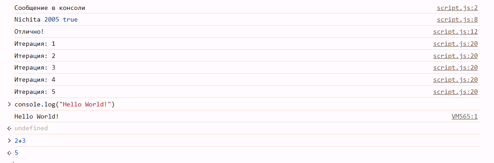

# Проект "Лабораторная работа #1"

## 1. Цель работы:  
Познакомиться с основами JavaScript, научиться писать и выполнять код в браузере и в локальной среде, разобраться с базовыми конструкциями языка. 

## 2. Запуск проекта:  
- Открыть в любой IDE и запустить локальный сервер. 
- В браузере открыть Dev Tools -> Консоль и увидеть результат. 
 
## 3. Выполнение лабораторной работы: 
1. В браузерной консоли вводим console.log("Hello World!") и смотрим результат. Затем вводим в консоль 2 + 3 и видимо что браузерная консоль выполняет код.  


## 1. Создаю файл `index.html`
```html
<!DOCTYPE html>
   <html lang="en">
     <head>
       <title>Привет, мир!</title>
     </head>
     <body>
       <script>
         alert("Привет, мир!");
         console.log("Hello, console!");
       </script>
     </body>
   </html>
```

## 2. Подключаю внешний файл `script.js`
Создаю файл `script.js` и добавляю в него код.

### 2.1 Вывод сообщений
```javascript
alert("Этот код выполнен из внешнего файла!");
console.log("Сообщение в консоли");
```

### 2.2 Определение переменных
Объявление переменных и работа с типами данных.

В файле script.js создайте несколько переменных:
name - строка с вашим именем.
birthYear - число, представляющее год вашего рождения.
isStudent - логическая переменная, указывающая, являетесь ли вы студентом

```javascript
let name = "Nichita";
let birthYear = 2005;
let isStudent = true;

console.log(name, birthYear, isStudent);
```

### 2.3 Запрос балла и условный оператор
```javascript
let score = prompt("Введите ваш балл:");
if (score >= 90) {  
  console.log("Отлично!");
} else if (score >= 70) {
  console.log("Хорошо");
} else {
  console.log("Можно лучше!");
}
```

### 2.4 Цикл `for`
```javascript
for (let i = 1; i <= 5; i++) {
  console.log(`Итерация: ${i}`);
}
```

## Чем отличается var от let и const?
var имеет функциональную область видимости и поднимается (hoisting), что может приводить к ошибкам. let имеет блочную область видимости и не позволяет повторно объявлять переменную. const также блочный, но его значение нельзя изменить после присвоения.

## Что такое неявное преобразование типов в JavaScript?
 Неявное преобразование типов — это автоматическое изменение типа данных при выполнении операций. Например, "5" + 2 превращается в строку "52", а "5" - 2 становится числом 3. Это может привести к неожиданным результатам, поэтому лучше явно приводить типы.

## Как работает оператор == в сравнении с ===?
 Оператор == сравнивает значения, преобразовывая их к одному типу, например, 5 == "5" возвращает true. === сравнивает без приведения типов, поэтому 5 === "5" даст false. Использование === предпочтительнее, так как оно предотвращает ошибки, связанные с неявным преобразованием.

## Запуск проекта
1. Откройте `index.html` в браузере.
2. Взаимодействуйте со всплывающим окном и следите за выводом в консоли (`F12` → вкладка "Console").

## Требования
- Любой современный браузер (Chrome, Firefox, Edge и т. д.)
- Включенный JavaScript

## Библиография:
https://developer.mozilla.org/en-US/docs/Web/JavaScript/Reference/Statements/var

https://habr.com/ru/articles/438880/

https://chm.org.ua/ru/const-var-let-raznitsa/

## Автор
Nichita, 2005
