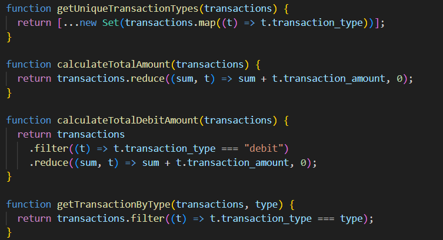

# Лабораторная работа №2

## Цель работы

Изучить основы работы с массивами и функциями в JavaScript, применяя их для обработки и анализа транзакций.

## Описание

Данный проект реализует анализ списка транзакций с использованием JavaScript. В коде представлены функции для обработки данных, включая вычисление общей суммы, фильтрацию по дате, поиск по типу транзакции и многое другое.

## Функционал

Проект содержит следующие функции:

1. **getUniqueTransactionTypes(transactions)** – получение уникальных типов транзакций.
2. **calculateTotalAmount(transactions)** – вычисление общей суммы всех транзакций.
3. **calculateTotalDebitAmount(transactions)** – вычисление суммы всех дебетовых транзакций.
4. **getTransactionByType(transactions, type)** – получение списка транзакций по их типу.
5. **getTransactionsInDateRange(transactions, startDate, endDate)** – фильтрация транзакций по диапазону дат.
6. **getTransactionsByMerchant(transactions, merchantName)** – фильтрация транзакций по магазину.
7. **calculateAverageTransactionAmount(transactions)** – вычисление средней суммы транзакций.
8. **getTransactionsByAmountRange(transactions, minAmount, maxAmount)** – фильтрация по диапазону сумм.
9. **findMostTransactionsMonth(transactions)** – определение месяца с наибольшим числом транзакций.
10. **findMostDebitTransactionMonth(transactions)** – определение месяца с наибольшим числом дебетовых транзакций.
11. **mostTransactionTypes(transactions)** – определение преобладающего типа транзакций.
12. **getTransactionsBeforeDate(transactions, date)** – получение транзакций до указанной даты.
13. **findTransactionById(transactions, id)** – поиск транзакции по ID.
14. **mapTransactionDescriptions(transactions)** – получение списка описаний транзакций.

## Пример данных

В коде используется массив `transactions`, содержащий информацию о транзакциях:

## Запуск

1. Создаю файл `script.js`.
2. Далее заполняю файлы `script.js` и `index.html` соответствующим правильным работающим кодом :
3.  - Для `index.html` 
            

    - Для `script.js`(первые 4 функции)
            

4. Выполнение программы: 
        

## Контрольные вопросы: 
- 1. Какие методы массивов можно использовать для обработки объектов в JavaScript?

1. **map()** - используется для создания нового массива путем изменения каждого элемента.
2. **filter()** - позволяет отфильтровать элементы по заданному условию.
3. **reduce()** - применяется для вычисления итогового значения, например, суммы всех элементов.
4. **forEach()** - выполняет действие для каждого элемента без создания нового массива.
5. **find()** и **findIndex()** - ищут первый элемент или его индекс, соответствующий условию.
6. **some()** и **every()** - проверяют, соответствуют ли один или все элементы заданному критерию.
7. **sort()** - используется для сортировки элементов в массиве.

- 2. Как сравнивать даты в строковом формате в JavaScript?

Даты в формате **YYYY-MM-DD** можно сравнивать как строки. Однако для надежного сравнения рекомендуется использовать объект **Date**, который позволяет корректно работать с датами, определять их разницу и упорядочивать их.

- 3. В чем разница между **map()**, **filter()** и **reduce()** при работе с массивами объектов?

**map()** создаёт новый массив, изменяя каждый элемент.
**filter()** возвращает новый массив, оставляя только элементы, соответствующие заданному условию.
**reduce()** применяется для агрегации данных, например, вычисления общей суммы или объединения элементов в одно значение.

## Библиография:

https://developer.mozilla.org/en-US/docs/Web/JavaScript/Reference/Global_Objects/Array

https://javascript.info/array-methods

https://www.w3schools.com/js/js_date_methods.asp
